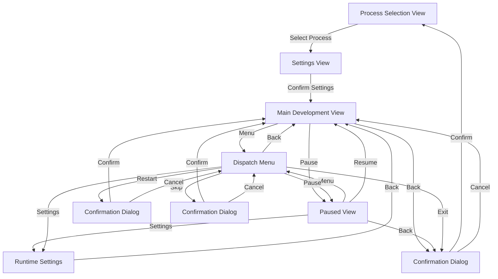
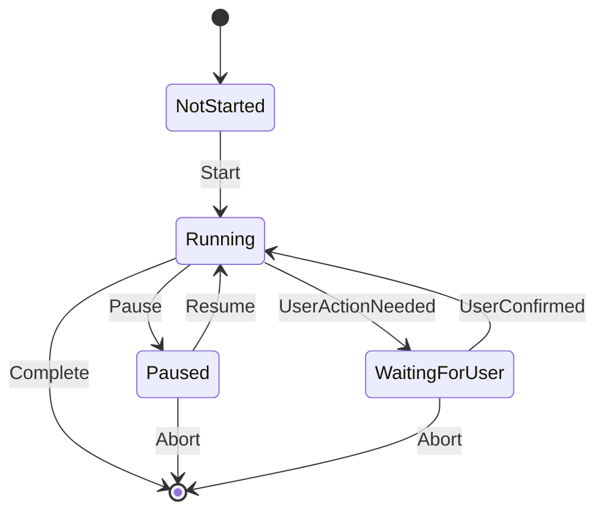
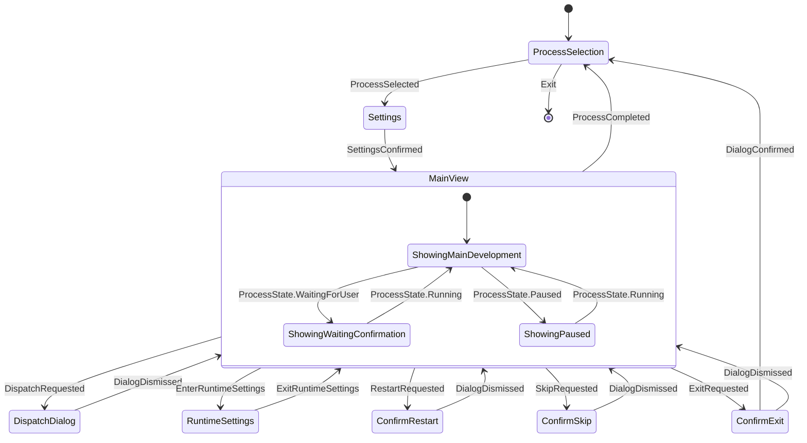
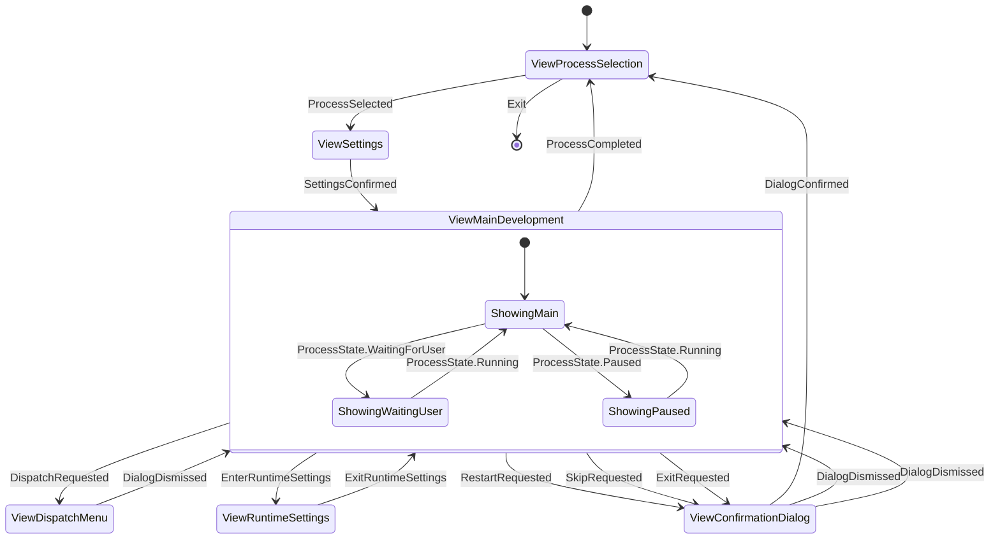

# Film Developer View Specification

## Architecture Overview

The application will follow the architecture pattern shown in example_cpp_view, using:

- A main application class (`FilmDeveloperApp`) managing view dispatch
- Individual view classes for each screen
- A shared view model for state management
- Clear separation between UI and business logic

## View Classes

### 1. Main Development View (ViewCpp)

Primary interface showing:

- Process title
- Current step information
- Status/timer information
- Movement state
- Pin states
- Control buttons:
  - Center: Menu
  - Back: Exit confirmation
  - Left: Restart step
  - Right: Skip step

### 2. Process Selection View (SubMenuCpp)

Simple menu with:

- C41 Color Process
- B&W Process
- E6 Process
- Back: Exit app

### 3. Settings View (VariableItemListCpp)

Single scrollable list with adjustable parameters:

- Push/Pull (-2 to +2 stops)
  - Fixed values: "-2", "-1", "0", "+1", "+2"
  - Default: "0"
- Roll Count (1-100)
  - Default: "1"
  - Long press left/right for faster adjustment
- Confirm: Start process
- Back: Return to process selection

### 4. Paused View (ViewCpp)

Dedicated pause screen showing:

- PAUSED header
- Current step information
- Elapsed time
- Control buttons:
  - Center: Menu
  - Right: Resume
  - Left: Settings
  - Back: Exit confirmation

### 5. Dialog System

#### a. Confirmation Dialog (DialogExCpp)
- Process start/abort confirmation
- Step completion requiring user intervention
- Exit confirmation during active process
- Step restart confirmation
- Step skip confirmation

#### b. Runtime Settings Dialog (ViewCpp)
- Adjust current step duration
- Back: Return to previous view

#### c. Dispatch Menu (SubMenuCpp)
- Pause/Resume process
- Runtime Settings
- Restart Step
- Skip Step
- Exit Process
- Back: Return to previous view

### 6. Waiting For User View (ViewCpp)

Dedicated user confirmation screen showing:
- WAITING FOR CONFIRMATION header
- Current step information
- Action required description
- Control buttons:
  - Center: Menu (opens dispatch dialog)
  - Right: Confirm and continue
  - Back: Exit confirmation

## View Navigation Flow

## State Machines

### Process State Machine (Model Layer)

### Application State Machine (Updated)

### View Navigation with Process States

## View-State-Process Mapping

| View ID | Application State | Valid Process States |
|---------|------------------|---------------------|
| ViewProcessSelection | ProcessSelection | NotStarted |
| ViewSettings | Settings | NotStarted |
| ViewMainDevelopment | ShowingMainDevelopment | Running |
| ViewPaused | ShowingPaused | Paused |
| ViewWaitingConfirmation | ShowingWaitingConfirmation | WaitingForUser |
| ViewConfirmationDialog | ConfirmRestart/ConfirmSkip/ConfirmExit | Any |
| ViewDispatchMenu | DispatchDialog | Any |
| ViewRuntimeSettings | RuntimeSettings | Any |

## Button Behavior Matrix

| View | Process State | Center Button | Right Button | Left Button | Back Button |
|------|--------------|---------------|--------------|-------------|-------------|
| Main | Running | Dispatch Menu | Skip Step | Restart Step | Exit Confirm |
| Main | Paused | Dispatch Menu | Resume | Settings | Exit Confirm |
| Main | WaitingForUser | Dispatch Menu | Confirm | - | Exit Confirm |
| Paused | Paused | Dispatch Menu | Resume | Settings | Exit Confirm |
| WaitingConfirmation | WaitingForUser | Dispatch Menu | Confirm | - | Exit Confirm |

## View-State Mapping

| View ID | Associated States |
|---------|------------------|
| ViewProcessSelection | ProcessSelection |
| ViewSettings | Settings |
| ViewMainDevelopment | MainView |
| ViewPaused | Paused |
| ViewConfirmationDialog | WaitingConfirmation, ConfirmRestart, ConfirmSkip, ConfirmExit |
| ViewDispatchMenu | DispatchDialog |
| ViewRuntimeSettings | RuntimeSettings |

## View Navigation Rules

1. **Main Development View**
   - Menu → Dispatch Menu
   - Back → Exit Confirmation Dialog
   - Left → Restart Confirmation
   - Right → Skip Confirmation

2. **Paused View**
   - Menu → Dispatch Menu
   - Resume → Main Development View
   - Settings → Runtime Settings
   - Back → Exit Confirmation Dialog

3. **Dispatch Menu**
   - Back → Previous View (Main or Paused)
   - Actions trigger appropriate transitions

4. **Runtime Settings**
   - Back → Previous View (Main or Paused)

5. **Confirmation Dialogs**
   - Confirm → Appropriate action
   - Cancel → Previous View
