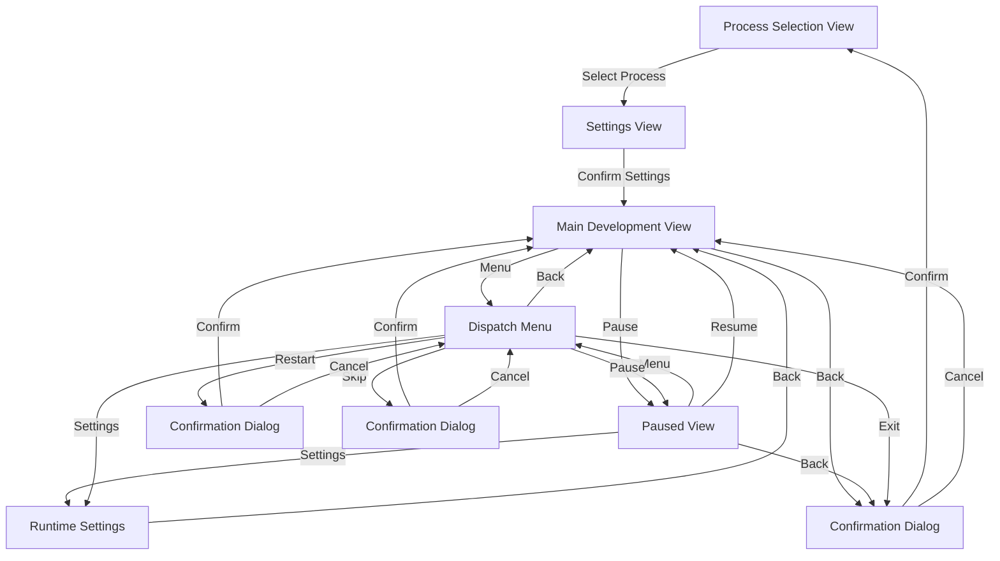
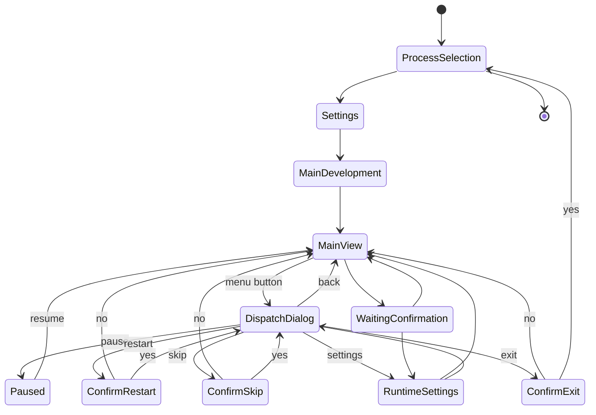
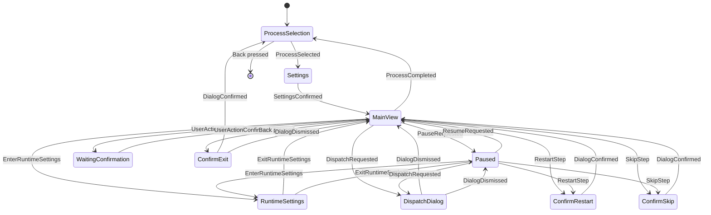
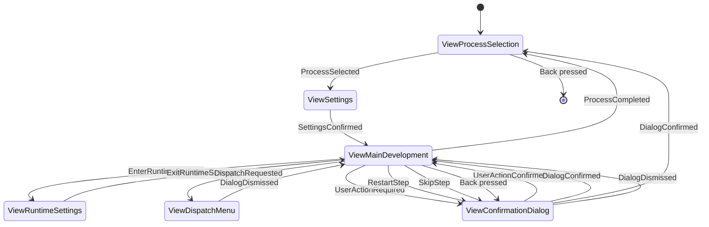

# Film Developer View Specification

## Architecture Overview

The application will follow the architecture pattern shown in example_cpp_view, using:

- A main application class (`FilmDeveloperApp`) managing view dispatch
- Individual view classes for each screen
- A shared view model for state management
- Clear separation between UI and business logic

## View Classes

### 1. Main Development View (ViewCpp)

Primary interface showing:

- Process title
- Current step information
- Status/timer information
- Movement state
- Pin states
- Control buttons:
  - Center: Menu
  - Back: Exit confirmation
  - Left: Restart step
  - Right: Skip step

### 2. Process Selection View (SubMenuCpp)

Simple menu with:

- C41 Color Process
- B&W Process
- E6 Process
- Back: Exit app

### 3. Settings View (VariableItemListCpp)

Single scrollable list with adjustable parameters:

- Push/Pull (-2 to +2 stops)
  - Fixed values: "-2", "-1", "0", "+1", "+2"
  - Default: "0"
- Roll Count (1-100)
  - Default: "1"
  - Long press left/right for faster adjustment
- Confirm: Start process
- Back: Return to process selection

### 4. Paused View (ViewCpp)

Dedicated pause screen showing:

- PAUSED header
- Current step information
- Elapsed time
- Control buttons:
  - Center: Menu
  - Right: Resume
  - Left: Settings
  - Back: Exit confirmation

### 5. Dialog System

#### a. Confirmation Dialog (DialogExCpp)
- Process start/abort confirmation
- Step completion requiring user intervention
- Exit confirmation during active process
- Step restart confirmation
- Step skip confirmation

#### b. Runtime Settings Dialog (ViewCpp)
- Adjust current step duration
- Back: Return to previous view

#### c. Dispatch Menu (SubMenuCpp)
- Pause/Resume process
- Runtime Settings
- Restart Step
- Skip Step
- Exit Process
- Back: Return to previous view

## View Navigation Flow

## State Machine

### States and Transitions

### State Behaviors

1. **MainView State**
   - Active development process
   - Background agitation running
   - Timer active
   - Can transition to: Paused, WaitingConfirmation, RuntimeSettings

2. **Paused State**
   - Process temporarily halted
   - Timer stopped
   - Agitation stopped
   - Can transition to: MainView, RuntimeSettings

3. **WaitingConfirmation State**
   - Process paused for user input
   - Timer stopped
   - Agitation stopped
   - Can transition to: MainView, RuntimeSettings

4. **RuntimeSettings State**
   - Overlay on current process state
   - Process remains in previous state
   - Can modify current step parameters

5. **DispatchDialog State**
   - Central control hub overlay
   - Process remains in previous state
   - Quick access to all control actions
   - Can transition to: MainView, Paused, ConfirmRestart, ConfirmSkip, RuntimeSettings, ConfirmExit

### Implementation State Machine

### View Navigation with Events

## View-State Mapping

| View ID | Associated States |
|---------|------------------|
| ViewProcessSelection | ProcessSelection |
| ViewSettings | Settings |
| ViewMainDevelopment | MainView |
| ViewPaused | Paused |
| ViewConfirmationDialog | WaitingConfirmation, ConfirmRestart, ConfirmSkip, ConfirmExit |
| ViewDispatchMenu | DispatchDialog |
| ViewRuntimeSettings | RuntimeSettings |

## View Navigation Rules

1. **Main Development View**
   - Menu → Dispatch Menu
   - Back → Exit Confirmation Dialog
   - Left → Restart Confirmation
   - Right → Skip Confirmation

2. **Paused View**
   - Menu → Dispatch Menu
   - Resume → Main Development View
   - Settings → Runtime Settings
   - Back → Exit Confirmation Dialog

3. **Dispatch Menu**
   - Back → Previous View (Main or Paused)
   - Actions trigger appropriate transitions

4. **Runtime Settings**
   - Back → Previous View (Main or Paused)

5. **Confirmation Dialogs**
   - Confirm → Appropriate action
   - Cancel → Previous View
