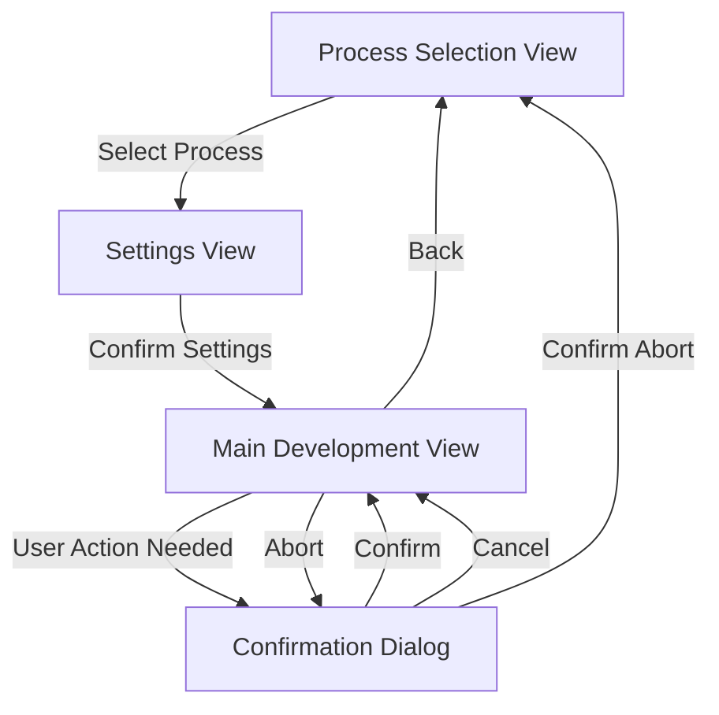

# Film Developer View Specification

## Architecture Overview

The application will follow the architecture pattern shown in example_cpp_view, using:

- A main application class (`FilmDeveloperApp`) managing view dispatch
- Individual view classes for each screen
- A shared view model for state management
- Clear separation between UI and business logic

## View Classes

### 1. Main Development View (ViewCpp)

Primary interface showing:

- Process title
- Current step information
- Status/timer information
- Movement state
- Pin states
- Control buttons

### 2. Process Selection View (SubMenuCpp)

Simple menu with:

- C41 Color Process
- B&W Process
- E6 Process

### 3. Settings View (VariableItemListCpp)

Single scrollable list with adjustable parameters:

- Push/Pull (-2 to +2 stops)
  - Fixed values: "-2", "-1", "0", "+1", "+2"
  - Default: "0"
- Roll Count (1-100)
  - Default: "1"
  - Long press left/right for faster adjustment

### 4. Confirmation Dialog (DialogExCpp)

For confirming:

- Process start
- Process abort
- Step completion requiring user intervention

## Navigation Flow



## Navigation Details

1. **Application Start**

   - Opens Process Selection View
   - User selects development process

2. **Process Selection → Settings**

   - After process selection, transitions to settings view
   - User adjusts push/pull and roll count in a single view

3. **Settings → Main Development**

   - After confirming settings (center button)
   - Begins development process
   - Settings are applied to process timing

4. **Main Development ↔ Confirmation Dialog**

   - When user intervention needed
   - When aborting process
   - When completing process

5. **Return to Start**
   - Via back button from main view
   - After process completion
   - After process abort confirmation

## State Flow

1. **Application Start**

   - Initialize settings with defaults
   - Create empty development state

2. **Process Selection**

   - Update selected process
   - Initialize relevant process parameters

3. **Settings Adjustment**

   - Modify settings
   - Calculate timing adjustments based on push/pull
   - Handle dynamic roll count increments

4. **Development Process**

   - Create development state with selected process
   - Update state through timer callbacks
   - Handle pausing and user interventions

5. **Process Completion**
   - Clean up development state
   - Reset to initial state
   - Preserve last used settings

## Custom Events Architecture

### Event Types

```cpp
enum class FilmDeveloperEvent : uint32_t {
    // Navigation Events
    ProcessSelected = 0,
    SettingsConfirmed = 1,
    ProcessAborted = 2,
    ProcessCompleted = 3,

    // Process Control Events
    StartProcess = 10,
    PauseProcess = 11,
    ResumeProcess = 12,

    // User Intervention Events
    UserActionRequired = 20,
    UserActionConfirmed = 21,

    // Timer Events
    TimerTick = 30,
    StepComplete = 31,

    // Motor Control Events
    MotorStateChanged = 40,
    AgitationComplete = 41,

    // Settings Events
    PushPullChanged = 50,
    RollCountChanged = 51
};
```

### Event Flow Patterns

1. **Process Selection Flow**

   ```
   ProcessSelection View -> ProcessSelected -> App -> SettingsView
   ```

2. **Settings Confirmation Flow**

   ```
   Settings View -> SettingsConfirmed -> App -> MainDevelopment View
   ```

3. **Development Control Flow**

   ```
   MainDevelopment View -> StartProcess -> App -> Process Controller
   Process Controller -> TimerTick -> App -> MainDevelopment View (update display)
   Process Controller -> StepComplete -> App -> MainDevelopment View (next step)
   ```

4. **User Intervention Flow**

   ```
   Process Controller -> UserActionRequired -> App -> Confirmation Dialog
   Confirmation Dialog -> UserActionConfirmed -> App -> Process Controller
   ```

5. **Motor Control Flow**
   ```
   Process Controller -> MotorStateChanged -> App -> MainDevelopment View
   Process Controller -> AgitationComplete -> App -> Process Controller
   ```

### Event Handling Responsibilities

1. **Application (FilmDeveloperApp)**

   - Manages view transitions based on navigation events
   - Routes process control events to Process Controller
   - Updates views based on state change events
   - Manages dialog displays for user interventions

2. **Process Controller**

   - Emits timer and step completion events
   - Triggers motor control events
   - Requests user interventions
   - Manages process state transitions

3. **Views**

   - Emit user interaction events
   - Update display based on received state events
   - Handle view-specific input events

4. **Motor Controller**
   - Emits motor state change events
   - Reports agitation completion

### Implementation Guidelines

1. **Event Propagation**

   - Views send events up to application
   - Application routes events to appropriate handlers
   - State changes propagate down to views

2. **State Updates**

   - All state changes should be event-driven
   - Views receive state updates through model updates
   - No direct state manipulation in views

3. **Error Handling**
   - Events should include error states
   - Error propagation through event system
   - Consistent error handling patterns

See IMPLEMENTATION.md for detailed implementation guidance.
