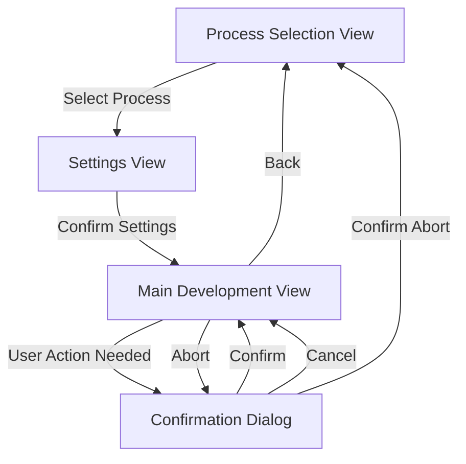

# Film Developer View Specification

## View Classes

### 1. Main Development View (ViewCpp)

Primary interface showing:

- Process title
- Current step information
- Status/timer information
- Movement state
- Pin states
- Control buttons

### 2. Process Selection View (SubMenuCpp)

Simple menu with:

- C41 Color Process
- B&W Process
- E6 Process

### 3. Settings View (VariableItemListCpp)

Single scrollable list with adjustable parameters:

- Push/Pull (-2 to +2 stops)
  - Fixed values: "-2", "-1", "0", "+1", "+2"
  - Default: "0"
- Roll Count (1-100)
  - Default: "1"
  - Long press left/right for faster adjustment

### 4. Confirmation Dialog (DialogExCpp)

For confirming:

- Process start
- Process abort
- Step completion requiring user intervention

## Navigation Flow



## Navigation Details

1. **Application Start**

   - Opens Process Selection View
   - User selects development process

2. **Process Selection → Settings**

   - After process selection, transitions to settings view
   - User adjusts push/pull and roll count in a single view
   - Roll count uses dynamic increments for efficient selection
   - Visual feedback of current selections

3. **Settings → Main Development**

   - After confirming settings (center button)
   - Begins development process
   - Settings are applied to process timing

4. **Main Development ↔ Confirmation Dialog**

   - When user intervention needed
   - When aborting process
   - When completing process

5. **Return to Start**
   - Via back button from main view
   - After process completion
   - After process abort confirmation

## Roll Count Implementation Details

The roll count will use dynamic increments to allow efficient selection of both small and large numbers:

- Range 1-10: Single step increments for precise selection
- Range 11-20: Two step increments (11,13,15,...)
- Range 21-50: Five step increments (21,26,31,...)
- Range 51-100: Ten step increments (51,61,71,...)

Long press behavior:

- Short press: Single increment based on current range
- Long press: Continuous increment with current range step size
- Extra long press: Double the increment speed

This approach maintains usability for both small and large roll counts while keeping the interface simple and efficient.

## Models

### 1. MainViewModel

Manages the state for the main development view:

```cpp
struct MainViewModel {
    // Process state
    const AgitationProcessStatic* current_process{nullptr};
    bool process_active{false};
    bool paused{false};

    // Adjustments
    int8_t push_pull_stops{0};  // -2 to +2
    uint8_t roll_count{1};      // 1-100

    // Display info
    char status_text[64]{};
    char step_text[32]{};
    char movement_text[32]{};
};
```

## Model Management

### Main Development View

- Initializes MainViewModel in init()
- Updates model in timer callback
- Locks model during updates using ViewCpp's model management
- Motor controller and process interpreter remain as dependencies

### Settings View

- Uses ProcessSettingsModel to track adjustments
- Handles dynamic roll count increments
- Maintains state between view transitions
- Provides computed values to process timing

### Dialog View

- Simple state management through DialogModel
- Updates based on user actions and process state
- Maintains message history if needed

## State Flow

1. **Application Start**

   - Initialize ProcessSettingsModel with defaults
   - Create empty MainViewModel

2. **Process Selection**

   - Update ProcessSettingsModel.selected_process
   - Initialize relevant process parameters

3. **Settings Adjustment**

   - Modify ProcessSettingsModel
   - Calculate timing adjustments based on push/pull
   - Handle dynamic roll count increments

4. **Development Process**

   - Create MainViewModel with selected process
   - Update state through timer callbacks
   - Handle pausing and user interventions

5. **Process Completion**
   - Clean up MainViewModel
   - Reset to initial state
   - Preserve last used settings in ProcessSettingsModel
