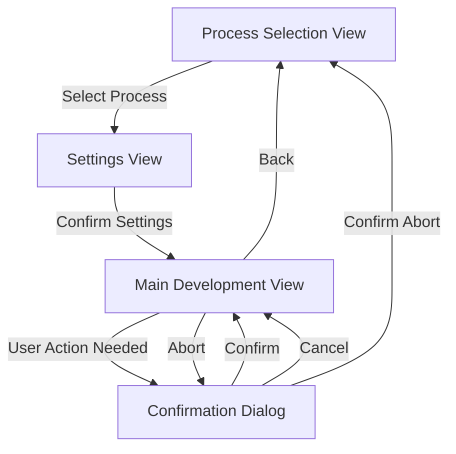
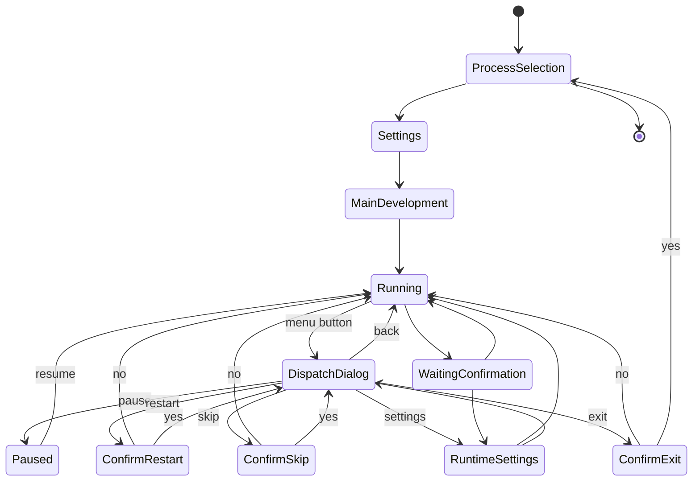
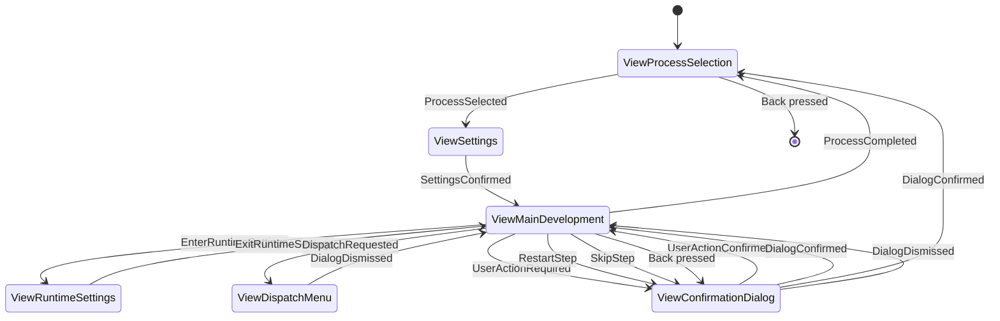

# Film Developer View Specification

## Architecture Overview

The application will follow the architecture pattern shown in example_cpp_view, using:

- A main application class (`FilmDeveloperApp`) managing view dispatch
- Individual view classes for each screen
- A shared view model for state management
- Clear separation between UI and business logic

## View Classes

### 1. Main Development View (ViewCpp)

Primary interface showing:

- Process title
- Current step information
- Status/timer information
- Movement state
- Pin states
- Control buttons

### 2. Process Selection View (SubMenuCpp)

Simple menu with:

- C41 Color Process
- B&W Process
- E6 Process

### 3. Settings View (VariableItemListCpp)

Single scrollable list with adjustable parameters:

- Push/Pull (-2 to +2 stops)
  - Fixed values: "-2", "-1", "0", "+1", "+2"
  - Default: "0"
- Roll Count (1-100)
  - Default: "1"
  - Long press left/right for faster adjustment

### 4. Dialog System (DialogExCpp)

Multiple dialog types for different scenarios:

#### a. Confirmation Dialog
- Process start/abort confirmation
- Step completion requiring user intervention
- Exit confirmation during active process

#### b. Runtime Settings Dialog
- Adjust current step duration
- Skip current step option
- Restart current step option
- Accessible during active development

#### c. Pause Dialog
- Resume process option
- Access to runtime settings
- Exit process option (with confirmation)

#### d. Wait For Confirmation Dialog
- Continue process option
- Access to runtime settings
- Required user action description

#### e. Dispatch Dialog
- Central hub for process control actions
- Accessible from main development screen
- Options:
  - Pause process
  - Restart current step
  - Skip current step
  - Runtime settings
  - Exit process

## Navigation Flow



## Navigation Details

1. **Application Start**

   - Opens Process Selection View
   - User selects development process

2. **Process Selection → Settings**

   - After process selection, transitions to settings view
   - User adjusts push/pull and roll count in a single view

3. **Settings → Main Development**

   - After confirming settings (center button)
   - Begins development process
   - Settings are applied to process timing

4. **Main Development ↔ Confirmation Dialog**

   - When user intervention needed
   - When aborting process
   - When completing process

5. **Return to Start**
   - Via back button from main view
   - After process completion
   - After process abort confirmation

## State Flow

1. **Application Start**

   - Initialize settings with defaults
   - Create empty development state

2. **Process Selection**

   - Update selected process
   - Initialize relevant process parameters

3. **Settings Adjustment**

   - Modify settings
   - Calculate timing adjustments based on push/pull
   - Handle dynamic roll count increments

4. **Development Process**

   - Create development state with selected process
   - Update state through timer callbacks
   - Handle pausing and user interventions

5. **Process Completion**
   - Clean up development state
   - Reset to initial state
   - Preserve last used settings

## Custom Events Architecture

### Event Types

```cpp
enum class FilmDeveloperEvent : uint32_t {
    // Navigation Events
    ProcessSelected = 0,
    SettingsConfirmed = 1,
    ProcessAborted = 2,
    ProcessCompleted = 3,

    // Process Control Events
    StartProcess = 10,
    PauseProcess = 11,
    ResumeProcess = 12,

    // User Intervention Events
    UserActionRequired = 20,
    UserActionConfirmed = 21,

    // Timer Events
    TimerTick = 30,
    StepComplete = 31,

    // Motor Control Events
    MotorStateChanged = 40,
    AgitationComplete = 41,

    // Settings Events
    PushPullChanged = 50,
    RollCountChanged = 51,

    // State Management Events
    StateChanged = 60,
    
    // Runtime Control Events
    EnterRuntimeSettings = 70,
    ExitRuntimeSettings = 71,
    StepDurationChanged = 72,
    SkipStep = 73,
    RestartStep = 74,
    
    // Pause Control Events
    PauseRequested = 80,
    ResumeRequested = 81,
    
    // Dialog Events
    DialogConfirmed = 90,
    DialogCancelled = 91,
    DialogDismissed = 92
};
```

### Event Flow Patterns

1. **Process Selection Flow**

   ```
   ProcessSelection View -> ProcessSelected -> App -> SettingsView
   ```

2. **Settings Confirmation Flow**

   ```
   Settings View -> SettingsConfirmed -> App -> MainDevelopment View
   ```

3. **Development Control Flow**

   ```
   MainDevelopment View -> StartProcess -> App -> Process Controller
   Process Controller -> TimerTick -> App -> MainDevelopment View (update display)
   Process Controller -> StepComplete -> App -> MainDevelopment View (next step)
   ```

4. **User Intervention Flow**

   ```
   Process Controller -> UserActionRequired -> App -> Confirmation Dialog
   Confirmation Dialog -> UserActionConfirmed -> App -> Process Controller
   ```

5. **Motor Control Flow**
   ```
   Process Controller -> MotorStateChanged -> App -> MainDevelopment View
   Process Controller -> AgitationComplete -> App -> Process Controller
   ```

## State Machine

### States and Transitions



### State Behaviors

1. **Running State**
   - Active development process
   - Background agitation running
   - Timer active
   - Can transition to: Paused, WaitingConfirmation, RuntimeSettings

2. **Paused State**
   - Process temporarily halted
   - Timer stopped
   - Agitation stopped
   - Can transition to: Running, RuntimeSettings

3. **WaitingConfirmation State**
   - Process paused for user input
   - Timer stopped
   - Agitation stopped
   - Can transition to: Running, RuntimeSettings

4. **RuntimeSettings State**
   - Overlay on current process state
   - Process remains in previous state
   - Can modify current step parameters

5. **DispatchDialog State**
   - Central control hub overlay
   - Process remains in previous state
   - Quick access to all control actions
   - Can transition to: Running, Paused, ConfirmRestart, ConfirmSkip, RuntimeSettings, ConfirmExit

### Implementation State Machine


### View Navigation with Events


